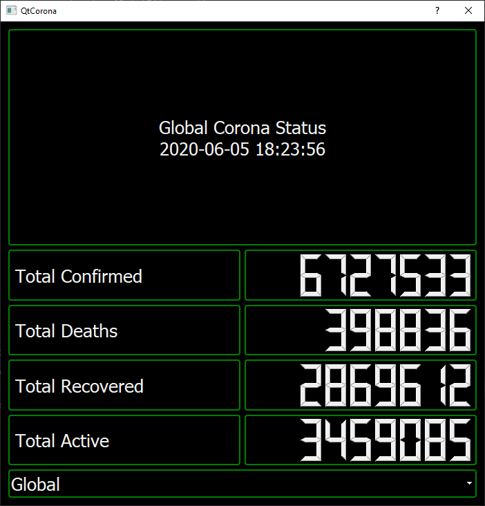
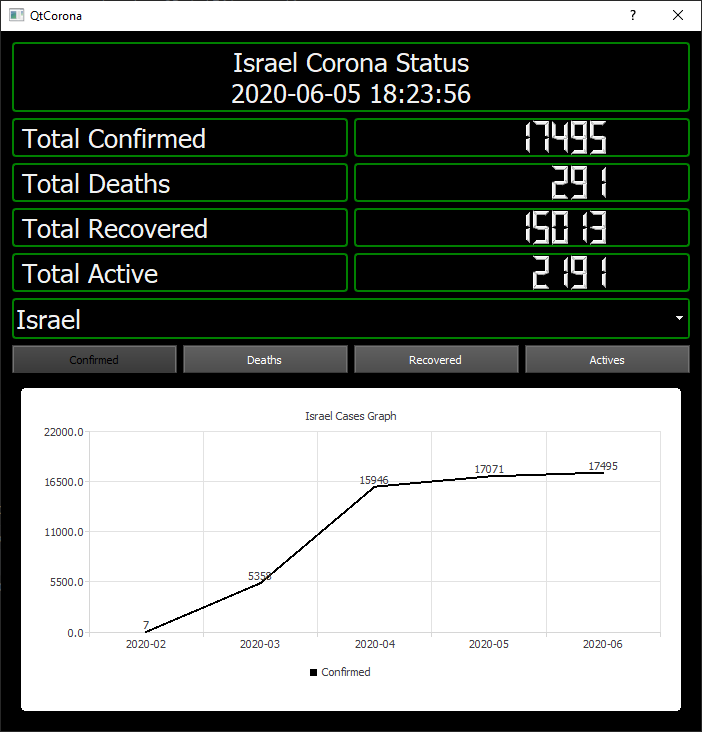
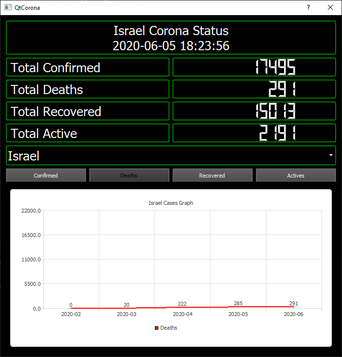
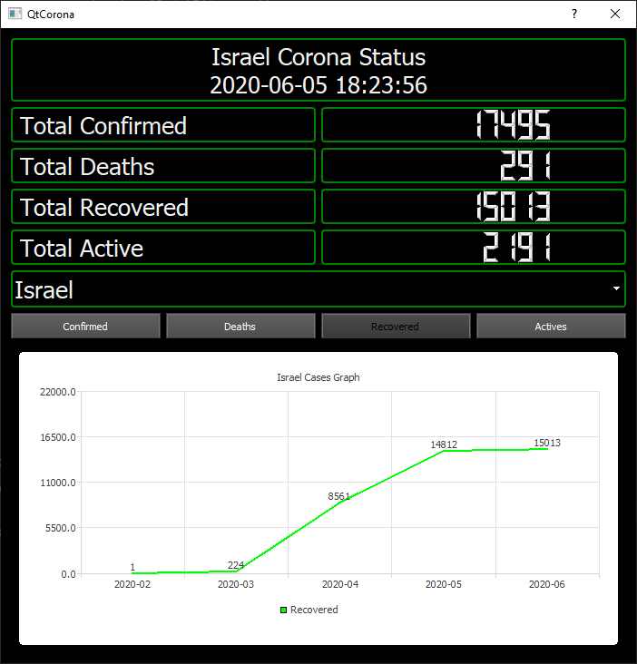
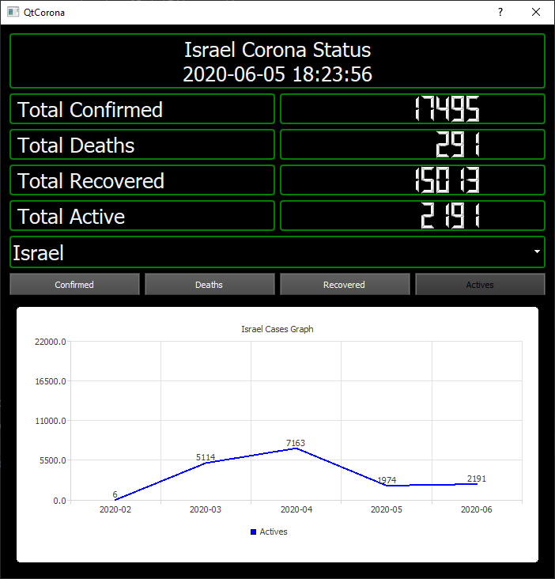

# PyCoronaUpdate
 A desktop application about the stats of the global corona pandemic.

 Run by double clicking the Corona Update.exe file.
 
### Start Screen:

## Country Graph Stats:
* <u><b>Confirmed Cases</u>:</b>

  
  
* <u><b>Death Cases</u>:</b>

 
  
* <u><b>Recovered Cases</u>:</b>

 
  
* <u><b>Actives Cases</u>:</b>

 

<u><b>Modules</u>:</b> Pyqt5, PyqtChart, requests.
 
<u><b>API</u>:</b> [Coronavirus COVID19 API](https://documenter.getpostman.com/view/10808728/SzS8rjbc?version=latest)
